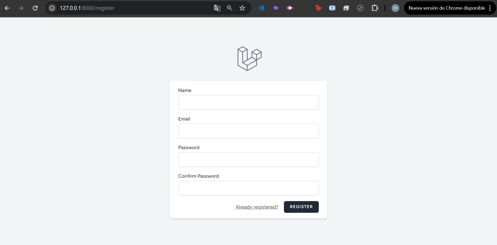
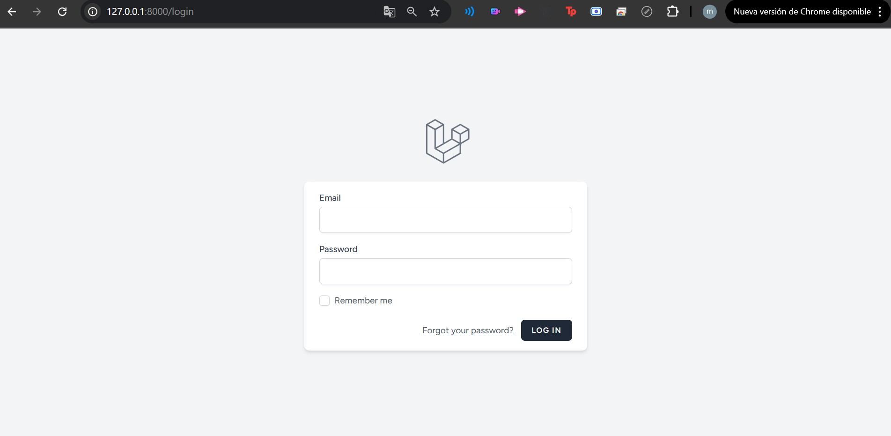
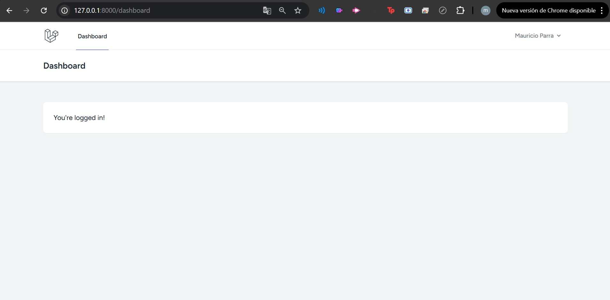
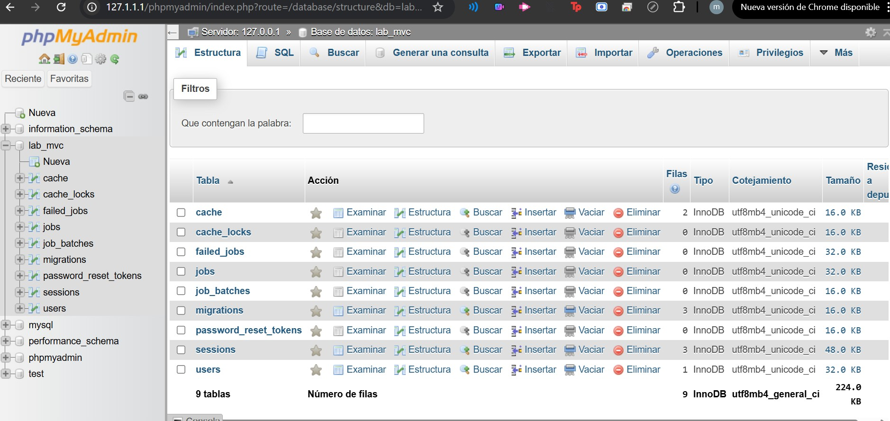

Laboratorio #2 – Implementación del Login en Laravel (MVC)

Repositorio: https://github.com/mauricioparra422/lab2-laravel-mvc

Curso: Ingeniería Web – UTP
Instructor: Ing. Irina Fong

Documentación del laboratorio: requisitos, comandos, códigos implementados, resultados y evidencias. (Fase de cierre del Laboratorio #1 / Módulo I, MVC).

1) Requisitos previos (Entorno)

Tecnologías y versiones utilizadas

🐘 PHP 8.2.12

📦 Composer 2.8.11

⚙️ Laravel 12.28.1

💻 XAMPP (Apache + MySQL)

📝 VS Code

🟢 Node.js + npm (para Vite)

🗄️ MySQL / phpMyAdmin

Secuencia de instalación y verificación

# Verificar herramientas
php -v
composer -V
node -v
npm -v

# Crear proyecto
# composer create-project laravel/laravel labLaravelLogin7

cd C:\xampp\htdocs\labLaravelLogin7

# Copiar .env y generar key
copy .env.example .env
php artisan key:generate

2) Introducción (MVC + estructura del proyecto)

Modelos (app/Models): representan y gestionan los datos (ej.: User).

Controladores (app/Http/Controllers): reciben la petición HTTP, coordinan la lógica y devuelven vistas/respuestas.

Vistas (resources/views): plantillas Blade (ej.: auth/login.blade.php, dashboard.blade.php).

Rutas (routes/web.php): definen endpoints y vinculan rutas con controladores/vistas.

Objetivo del laboratorio: implementar autenticación (registro/login) siguiendo el patrón MVC y dejar una ruta protegida (/dashboard).

3) Flujo de comandos usados (Autenticación)

Instalación de Breeze (login/registro)

composer require laravel/breeze --dev
php artisan breeze:install blade
php artisan migrate

Assets (Vite)

npm install
npm run dev   # modo desarrollo
# npm run build  # producción

Servidor de desarrollo

php artisan serve
# App en: http://127.0.0.1:8000

4) Base de datos (configuración y respaldo)

Configuración en .env:

DB_CONNECTION=mysql
DB_HOST=127.0.0.1
DB_PORT=3306
DB_DATABASE=lab_mvc
DB_USERNAME=root
DB_PASSWORD=

Migraciones ejecutadas:

php artisan migrate

5) Directorios clave (ejemplos)

routes/web.php:

Route::get('/', function(){ return view('welcome'); });
Route::get('/dashboard', \App\Http\Controllers\DashboardController::class)
    ->middleware(['auth', 'verified'])->name('dashboard');

resources/views/ – vistas Blade (ej.: auth/login.blade.php, dashboard.blade.php).

app/Http/Controllers/ – controladores de Breeze para login/registro.

app/Models/User.php – modelo Eloquent para la tabla users.

6) Evidencias

Capturas incluidas en docs/:

### Registro

### Login

### Dashboard

### Tablas en phpMyAdmin

7) Dificultades encontradas y soluciones

Compatibilidad de versiones (PHP/Laravel).
Solución: Se verificó con php -v y composer -V y se usó PHP 8.2.12 con Laravel 12.28.1.

Conexión a la BD (credenciales .env / migraciones).
Solución: Ajustar .env con DB, usuario y pass, ejecutar php artisan migrate y revisar phpMyAdmin.

CSS no se reflejaba en la página.
Solución: Ejecutar npm run dev y confirmar @vite(['resources/css/app.css','resources/js/app.js']) en las vistas.

Error “npm no se reconoce” al crear el proyecto.
Solución: Instalar Node.js LTS y ejecutar npm install + npm run dev.

8) Resultados

Proyecto Laravel funcional con autenticación (Breeze), dashboard protegido y BD MySQL configurada.

Assets compilados correctamente con Vite.

Evidencias y backup SQL incluidos en el repositorio.

9) Conclusiones y Aprendizajes

Este laboratorio permitió comprender el ciclo de vida de una petición en Laravel y el uso del patrón MVC. Se aprendió a configurar correctamente el entorno (PHP, Composer, Node.js, MySQL), instalar Breeze para login y registro, y trabajar con Vite para los estilos.

La práctica fue clave para aplicar la teoría a un proyecto real, enfrentar errores de instalación y configuración, y desarrollar habilidades de resolución de problemas en un entorno de desarrollo moderno.

10) Referencias

Laravel – Documentación oficial

Laravel Breeze – Autenticación simple

Vite con Laravel

11) Información del desarrollador

Nombre: Mauricio Parra

Correo: [mauricio.parra@utp.ac.pa
]

Curso: Ingeniería Web – UTP

Instructor del Laboratorio: Ing. Irina Fong

Fecha de ejecución: 26-09-2025

Fecha de entrega: 28-09-2025